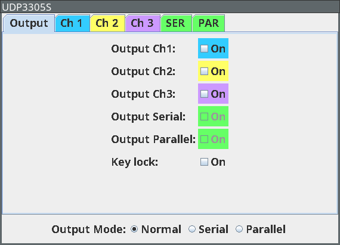
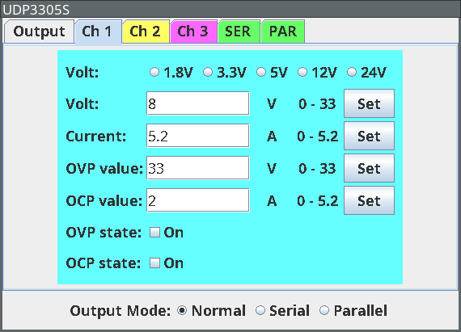
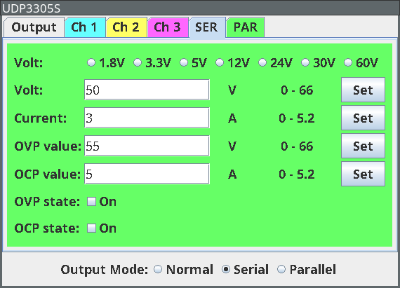

# Tools for UDP3305S / UDP3305S-E lab power supplies

Currently, there are the following items in this repository:

* `rec2csv` is a command line tool for converting `*.rec` files to csv format
* a TestController config file for these power supplies

# rec2csv

Convert `*.rec` files created by a UNI-T UDP3305S or UPD3305S-E lab power supply to
CSV format.

These lab power supplies have an undocumented `RECORDER` functionality that
allows logging readout data to a file. Unfortunately, the file format is binary
and undocumented, so a little reverse engineering was required to make use of
these files.

## Usage

Make the `rec2csv` python script executable and run it with the `*.rec` file as
the only argument.  The data is written to STDOUT.

    ./rec2csv foo.REC

To save the output to a file use shell redirection:

    ./rec2csv foo.REC > foo.csv

If you are not on LINUX, you may need to call the python interpreter explicitly:
    
    python rec2csv foo.REC > foo.csv

# TestController config file

The file under `testcontroller/` is a configuration file for the popular
[TestController](https://lygte-info.dk/project/TestControllerIntro%20UK.html)
software. So far, it allows data logging for all three channels as well as in
serial or parallel mode. Channel setup works but advanced functions such as
recording, delayer or list mode are not implemented – I don't think they are
all that usefull if you are cpntrolling the device remotely.

The config file has been submitted to the Testcontroller project and should be
included in the next release. So you don't have to download it form here.
However, I'll be happy to get bug reports or feature requests here.

Thanks to Wolfram Bahmann for his input and testing the config on a UDP3305S-E.

# Contributing

If you find an error, miss a feature or have figured out a piece of data that I
have missed, please open an issue and let me know. Please don't submit
pull-requests before discussing your issue.

